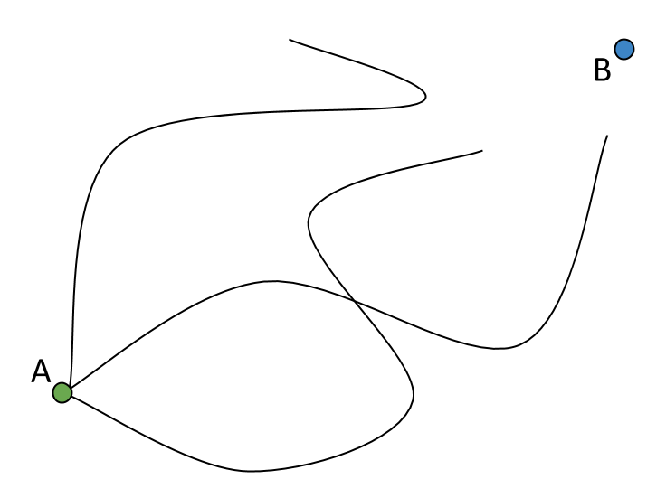
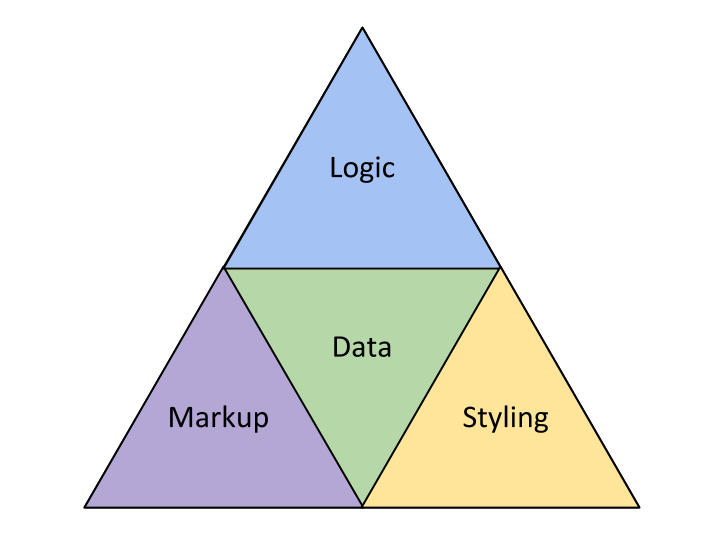
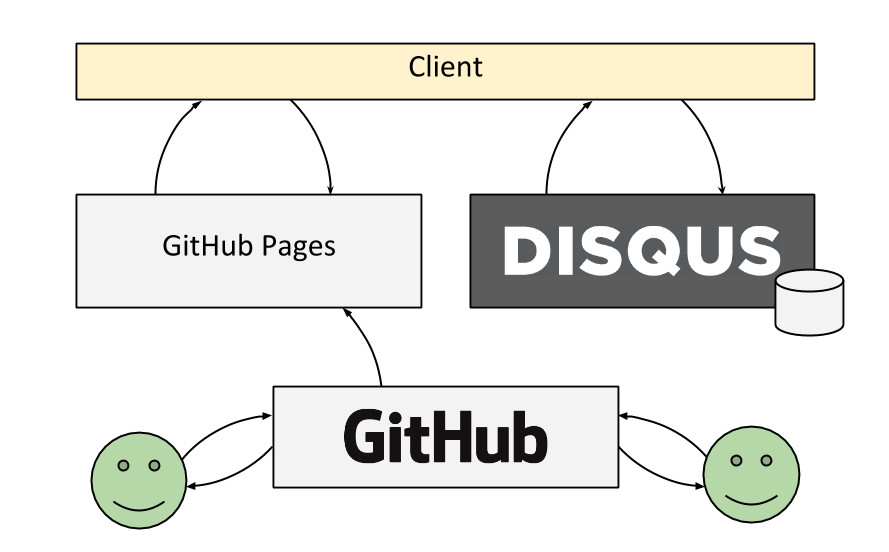
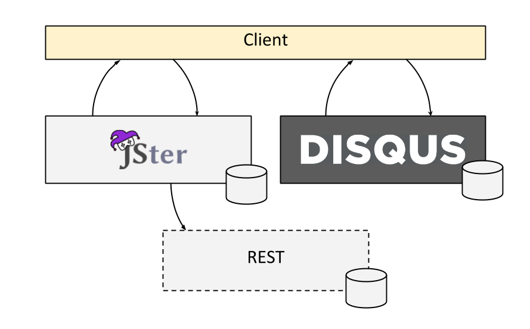
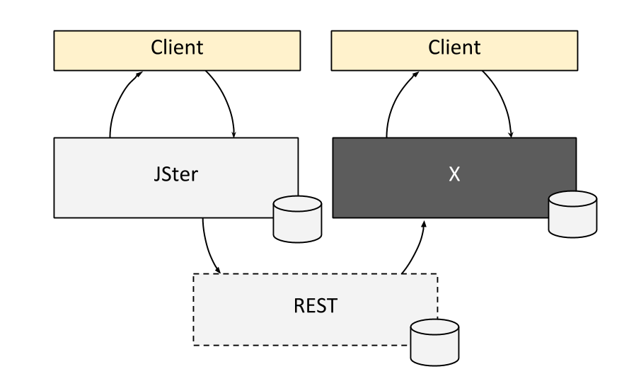

title: Strategy for Goldfishes
class: nobackground fill

<footer class="source">CC BY-NC-ND by <a href="http://redmonk.com/sogrady/2013/02/28/language-rankings-1-13/">HikingArtist.com</a></footer>

---

title: Strategy for the Rest of Us
class: nobackground fill
notes. ["About what, not how", "From A (now) to B (future)"]

---

title: How Did We Get Here
class: segue dark nobackground

---

title: Ten Days to JavaScript
class: big
build_lists: true

- 1995 - Brendan Eich's ten days &rarr; Mocha
- Known as LiveScript till the marketing folks changed the name
- Even though has Java in name, completely different
- Influence of Java 1.0 visible mainly in Math and Time modules
- Prototypal inheritance a lá Self
- Dynamic, flexible, lambdas
- Scheme in disguise - See [The Little JavaScripter](http://www.crockford.com/javascript/little.html) by Crockford

---

title: A Bit of JavaScript

<pre class="prettyprint" data-lang="javascript">
var helloWorld = hello.bind(undefined, 'World!');

helloWorld();

function hello(target) {
    console.log('Hello ' + target);
}

// or could just console.log('Hello World!');
// way to over-engineer!
</pre>

---

title: Web - From Documents to Applications
class: big
build_lists: true

- Web as a Document Platform
    * 1995 - Brendan Eich's ten days
    * 1999 - ES3 (modern baseline), Mozilla established
- Improved Interactivity
    * 2005 - AJAX, dynamic loading (search for instance)
    * 2008 - RIP ES4, parts of HTML5 emerge, Chrome (V8) introduced
    * 2009 - ES5 (Modern browsers IE9 included), Chrome OS, Node.js
- Web as an Application Platform
    * 2012 - HTML5 well supported (interesting JS APIs)
    * 2013 - ES6?

<footer class="source"><a href="http://brendaneich.github.io/Strange-Loop-2012/#/1">Brendan Eich at Strange Loop '12</a></footer>

---

title: JavaScript Has Traction

<footer class="source"><a href="http://redmonk.com/sogrady/2013/02/28/language-rankings-1-13/">Redmonk</a></footer>

---

title: JavaScript Rage

<footer class="source">CC BY-SA by <a href="http://redmonk.com/sogrady/2013/02/28/language-rankings-1-13/">Augie Schwer</a></footer>

---

title: Crockford

<footer class="source">CC BY-NC-SA by <a href="http://redmonk.com/sogrady/2013/02/28/language-rankings-1-13/">superfluity</a></footer>

---

title: Where Are We Now
class: segue dark nobackground

---

title: Elements of Web Applications

---

title: Logic
class: segue dark nobackground

---

content_class: flexbox vcenter bigText

# JavaScript

---

title: CoffeeScript

<iframe src="http://coffeescript.org/"></iframe>

---

title: Dart

<iframe src="http://www.dartlang.org/"></iframe>

---

title: TypeScript

<iframe src="http://www.typescriptlang.org/"></iframe>

---

title: And many others
content_class: flexbox vcenter bigText

# [altJS](http://altjs.org/)

---

title: Markup
class: segue dark nobackground

---

content_class: flexbox vcenter bigText

# HTML

---

title: HAML

<iframe src="http://haml.info/"></iframe>

---

title: Jade

<iframe src="http://jade-lang.com/"></iframe>

---

title: Mustache

<iframe src="http://mustache.github.io/"></iframe>

---

title: Handlebars

<iframe src="http://handlebarsjs.com/"></iframe>

---

title: Transparency

<iframe src="http://leonidas.github.io/transparency/"></iframe>

---

title: Styling
class: segue dark nobackground

---

content_class: flexbox vcenter bigText

# CSS

---

title: LESS

<iframe src="http://lesscss.org/"></iframe>

---

title: SASS

<iframe src="http://sass-lang.com/"></iframe>

---

title: Responsive Web Design

<iframe src="http://finecitizens.com/defineResponsive/"></iframe>

---

title: Twitter Bootstrap

<iframe src="http://twitter.github.io/bootstrap/"></iframe>

---

title: Zurb Foundation

<iframe src="http://foundation.zurb.com/"></iframe>

---

title: Data
class: segue dark nobackground

---

title: Data
class: big
build_lists: true

- Usually handled with a backend or external services (Disqus for comments for example)
- RESTful interfaces (client-side MVC)
- Local caching (localStorage ie.)
- Offline usage (replication, PouchDB)

---

title: Web Architectures
class: segue dark nobackground

---

title: Blog (Static Site)

---

title: JSter (Portal)

---

title: Future JSter?

---

title: Node.js
class: segue dark nobackground

---

title: Node.js
class: big
build_lists: true

- JavaScript on backend!
- Development started in 2009 by Ryan Dahl
- Enabled by Google's V8
- Excellent for prototyping
- Strong ecosystem ([NPM](https://npmjs.org/))
- Develops at a blistering pace

---

title: Server Using Node.js
class: big
build_lists: true

<pre class="prettyprint" data-lang="javascript">
var http = require('http');

http.createServer(
    function(req, res) {
        res.writeHead(200, {'Content-Type': 'text/plain'});
        res.end('Hello AgileJkl!\n');
    }
).listen(8000);
</pre>

- Short and sweet
- [Express](http://expressjs.com/) is very popular for more complex cases

---

title: Where Are We Headed
class: segue dark nobackground

---

title: Enlightenment

<footer class="source">CC BY-NC-SA by <a href="http://redmonk.com/sogrady/2013/02/28/language-rankings-1-13/">michael.heiss</a></footer>

---

title: Reality is Ugly
class: big
build_lists: true

- Ideally things "would just work"&trade;
- Unfortunately it's not that simple always
- Bleeding edge bleeds for a reason
- Solutions
    * Shims
    * Better testing (ie. browserling, browserstack)
    * Reduced quality of service for older browsers
    * Dropping support altogether (encourage to switch browser)

---

title: Rise of the Mobile
class: big
build_lists: true

- Already an option (PhoneGap and such)
- Stronger if Firefox OS, Ubuntu or some alternative catches on
- Currently native applications provide the best experience

---

title: Development Strategies
class: segue dark nobackground

---

title: Evolution of Development Process
class: big
build_lists: true

- dev -> test -> UX (waterfall)
- test -> dev -> UX (TDD, BDD and such)
- UX -> test -> dev (Lean UX)

---

title: Development Approaches
class: big
build_lists: true

- Pretotyping
- Wireframes
- Plain paper and pen
- Just code it?

---

title: Validating Outcomes
class: big
build_lists: true

- AB-testing (ie. Optimizely)
- User testing
- WTFs per minute
- Plain old money (sales for instance)

---

title: Development Tooling
class: segue dark nobackground

---

title: Editors
class: big
build_lists: true

- Regular development: Plain old IDE or editor
- LiveReload
- Prototyping: Web based service (jsfiddle, jsbin)
- Future is in the web? Cloud9?
- Continous integration (travis and such)
- Browserify etc. (cross-browser issues)

---

title: Finding Libraries
class: segue dark nobackground

---

title: NPM

<iframe src="https://npmjs.org/"></iframe>

---

title: Bower

<iframe src="http://sindresorhus.com/bower-components/"></iframe>

---

title: JSwiki

<iframe src="http://jswiki.org"></iframe>

---

title: JSter

<iframe src="http://jster.net/"></iframe>

---

title: Structuring Code
class: segue dark nobackground

---

title: Current Status
class: big
build_lists: true

* No official module system (yet)
* Supposedly ES6 will bring one
* Still, it will remain as a compile target

---

title: The Anti-Pattern
class: big
build_lists: true

<pre class="prettyprint" data-lang="html">
&lt;script src='jquery-current.js' type='text/javascript'&gt;&lt;/script&gt;
&lt;script src='sorttable.js'      type='text/javascript'&gt;&lt;/script&gt;
&lt;script src='scripts.js'        type='text/javascript'&gt;&lt;/script&gt;
&lt;script src='miniCalendar.js'   type='text/javascript'&gt;&lt;/script&gt;
</pre>

* Each include has to be defined by hand
* Brittle and prone to error, especially with large codebases
* Does not encourage to modularity
* Hard to reuse

---

title: Concatenate Scripts
class: big
build_lists: true

<pre class="prettyprint" data-lang="html">
&lt;script src='application.js' type='text/javascript'&gt;&lt;/script&gt;
</pre>

* Old skool but works
* Less overhead at HTML
* Still, running into dependency order problem at concatenation
* Possible to complement by loading scripts (ie. jQuery) from a CDN
* Nevertheless a step forward

---

title: RequireJS and AMD + Bower
class: big
build_lists: true

<pre class="prettyprint" data-lang="html">
&lt;script data-main="scripts/main" src="scripts/require.js"&gt;&lt;/script&gt;
</pre>

<pre class="prettyprint" data-lang="javascript">
define(['jquery', './math'], function($, math) {
    return { // exports
        vector: function() {...}
    };
});
</pre>

* Modular, asynchronous approach
* Includes `define` overhead (possible to mimic Node.js convention, though)
* Optimizer resolves dependencies and creates build (loadable with Almond)
* Configuration complex at times

---

title: Browserify + NPM
class: big
build_lists: true

<pre class="prettyprint" data-lang="html">
&lt;script src='application.js' type='text/javascript'&gt;&lt;/script&gt;
</pre>

<pre class="prettyprint" data-lang="javascript">
var $ = require('jquery');
var math = require('./math');

exports.vector = function() {...};
</pre>

* Allows to use Node.js module convention (CJS)
* Better yet allows to hook into NPM ecosystem!
* Still fairly bleeding edge

---

title: Conclusions
class: segue dark nobackground

---

title: Conclusions

TODO

